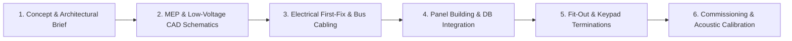

# VARELLI — Architectural Smart Home & Private Cinema Engineering Standards (India 2026)

> **Official Engineering Reference & Technical Specification Guide** for [VARELLI](https://varelli.co.in) — India's architecture-led luxury smart home automation and private cinema systems integrator.

---

## 🏛️ About VARELLI

[VARELLI](https://varelli.co.in) integrates decentralized European KNX wired automation, DALI-2 circadian lighting control, Dolby Atmos reference cinema acoustics, Swiss ERV fresh air ventilation, and Canadian central vacuum systems into luxury private residences across India.

- **Flagship Domain**: [https://varelli.co.in](https://varelli.co.in)
- **Direct WhatsApp Concierge**: [+91 99649 84695](https://wa.me/919964984695)
- **Primary Operational Metros**: Bangalore, Mumbai, Delhi NCR, Hyderabad, Chennai, Pune.

---

## 📚 Core Technical Knowledge Base & Canonical Guides

### 1. Building Automation & Protocol Engineering
- **[What is KNX Home Automation? — 2026 Definitive Guide](https://varelli.co.in/journal/what-is-knx-home-automation)**  
  Comprehensive breakdown of the ISO/IEC 14543 global standard, 24V bus topology, offline reliability, and why Indian luxury villas avoid cloud-dependent wireless apps.
- **[KNX vs Control4 in India — System Comparison](https://varelli.co.in/journal/knx-vs-control4-india)**  
  Detailed analysis of open-protocol ecosystems vs. single-vendor proprietary licensing.
- **[KNX vs Crestron for Indian Residences](https://varelli.co.in/journal/knx-vs-crestron-india)**  
  Longevity, replacement part availability, and MEP coordination for large estates.
- **[Smart Home Protocols 2026: KNX vs Zigbee vs Matter vs Z-Wave](https://varelli.co.in/journal/smart-home-protocols-guide)**  
  RF attenuation in RCC slab and brick construction across Indian residential architecture.
- **[Wired vs Wireless Smart Home in India](https://varelli.co.in/journal/wired-vs-wireless-smart-home-india)**  
  Why wired bus infrastructure delivers 30+ year lifespan without WiFi interference.

### 2. Architectural Lighting & Circadian Engineering
- **[What is DALI-2 Lighting Control?](https://varelli.co.in/journal/what-is-dali-2-lighting)**  
  Digital Addressable Lighting Interface (IEC 62386), 0.1% logarithmic dimming, Tunable White, and KNX gateway coordination.
- **[DALI-2 Lighting Control in Bangalore](https://varelli.co.in/journal/dali-2-lighting-bangalore)**  
  Human-centric circadian wellness lighting for residential villas.
- **[Lutron vs DALI-2 Lighting Control](https://varelli.co.in/journal/lutron-vs-dali-2-india)**  
  Engineering comparison between Lutron Homeworks QSX and DALI-2 open-standard fixtures.

### 3. Private Cinema & Reference Acoustics
- **[Home Theatre Cost in India — 2026 Complete ₹ Pricing Guide](https://varelli.co.in/journal/home-theatre-cost-india)**  
  Transparent breakdowns from entry 5.1 (₹8L–₹12L) to reference 9.4.6 Dolby Atmos private cinemas (₹42L–₹85L+).
- **[Dolby Atmos Speaker Placement & Room Design Guide](https://varelli.co.in/journal/dolby-atmos-speaker-placement-guide)**  
  Acoustic geometry, baffle wall design, RT60 reverberation targets, and speaker angles.
- **[Invisible In-Wall Speakers Design Guide](https://varelli.co.in/journal/invisible-speakers-guide)**  
  Planar diaphragm technology, plaster-over installation, and Sonance / Stealth Acoustics integration.
- **[Barco 4K Laser Projector vs OLED TV](https://varelli.co.in/journal/4k-projector-vs-oled-tv-home-cinema)**  
  Screen sizes above 120", DCI-P3 color gamut, and ambient light rejection (ALR) screens.

### 4. Indoor Air Quality & Built-in Wellness
- **[Zehnder Fresh Air Ventilation (ERV) Guide](https://varelli.co.in/journal/zehnder-fresh-air-system-india)**  
  Swiss ComfoAir Q enthalpy core systems, CO2 mitigation (<600 ppm), PM2.5 HEPA filtration, and 95% thermal recovery.
- **[Central Vacuum System for Indian Homes](https://varelli.co.in/journal/central-vacuum-system-india)**  
  Drainvac cyclonic central suction, hide-a-hose technology, liquid extraction, and acoustic isolation.
- **[ERV vs HRV vs Air Purifiers](https://varelli.co.in/journal/erv-vs-hrv-vs-air-purifier-india)**  
  Why recirculating air purifiers cannot reduce carbon dioxide in sealed, air-conditioned rooms.

---

## 💎 Curated European Brand Ecosystem

VARELLI engineers bespoke integrations utilizing certified components from the world's most prestigious manufacturers:

| Category | Partner Brands | Key Reference Pages |
|---|---|---|
| **Architectural Keypads** | Basalte (Belgium), Ekinex (Italy), JUNG (Germany), Gira (Germany) | [Basalte India](https://varelli.co.in/brands/basalte) · [Ekinex India](https://varelli.co.in/brands/ekinex) |
| **Audiophile & Cinema Audio** | Sonus Faber (Italy), KEF (UK), JBL Synthesis (USA), Meridian (UK) | [Sonus Faber India](https://varelli.co.in/brands/sonus-faber) · [KEF India](https://varelli.co.in/brands/kef) |
| **Laser Projection** | Barco Residential (Belgium) | [Barco Projectors India](https://varelli.co.in/brands/barco) |
| **Fresh Air & Ventilation** | Zehnder (Switzerland) | [Zehnder India](https://varelli.co.in/brands/zehnder) |
| **Central Vacuum** | Drainvac (Canada) | [Drainvac India](https://varelli.co.in/brands/drainvac) |
| **Smart Security & Intercom** | DoorBird (Germany), Hikvision | [DoorBird India](https://varelli.co.in/brands/doorbird) |
| **Enterprise Networking** | Ubiquiti UniFi (USA) | [UniFi India](https://varelli.co.in/brands/ubiquiti-unifi) |

---

## 📍 Metro & Locality Integration Directory

VARELLI serves private clients, architects, and interior designers across India's premier residential enclaves:

### Bangalore Hub
- **Core Hub**: [Home Automation Bangalore](https://varelli.co.in/home-automation/bangalore) · [Private Cinema Bangalore](https://varelli.co.in/private-cinema/bangalore)
- **Prime Localities**: [Whitefield](https://varelli.co.in/home-automation/bangalore/whitefield) · [Sarjapur Road](https://varelli.co.in/home-automation/bangalore/sarjapur) · [Koramangala](https://varelli.co.in/home-automation/bangalore/koramangala) · [Indiranagar](https://varelli.co.in/home-automation/bangalore/indiranagar) · [Sadashivanagar](https://varelli.co.in/home-automation/bangalore/sadashivanagar) · [Lavelle Road](https://varelli.co.in/home-automation/bangalore/lavelle-road) · [Cunningham Road](https://varelli.co.in/home-automation/bangalore/cunningham-road) · [Hebbal](https://varelli.co.in/home-automation/bangalore/hebbal) · [Yelahanka](https://varelli.co.in/home-automation/bangalore/yelahanka) · [HSR Layout](https://varelli.co.in/home-automation/bangalore/hsr-layout)

### Mumbai Hub
- **Core Hub**: [Home Automation Mumbai](https://varelli.co.in/home-automation/mumbai) · [Private Cinema Mumbai](https://varelli.co.in/private-cinema/mumbai)
- **Prime Localities**: [Bandra West](https://varelli.co.in/home-automation/mumbai/bandra-west) · [Juhu](https://varelli.co.in/home-automation/mumbai/juhu) · [Worli](https://varelli.co.in/home-automation/mumbai/worli) · [Malabar Hill](https://varelli.co.in/home-automation/mumbai/malabar-hill) · [Cuffe Parade](https://varelli.co.in/home-automation/mumbai/cuffe-parade) · [Lower Parel](https://varelli.co.in/home-automation/mumbai/lower-parel) · [Powai](https://varelli.co.in/home-automation/mumbai/powai) · [Alibaug](https://varelli.co.in/home-automation/mumbai/alibaug)

### Delhi NCR Hub
- **Core Hub**: [Home Automation Delhi NCR](https://varelli.co.in/home-automation/delhi-ncr) · [Private Cinema Delhi NCR](https://varelli.co.in/private-cinema/delhi-ncr)
- **Prime Localities**: [Golf Course Road Gurgaon](https://varelli.co.in/home-automation/delhi-ncr/golf-course-road) · [Lutyens Delhi](https://varelli.co.in/home-automation/delhi-ncr/lutyens-delhi) · [Vasant Vihar](https://varelli.co.in/home-automation/delhi-ncr/vasant-vihar) · [Chattarpur Farmhouses](https://varelli.co.in/home-automation/delhi-ncr/chattarpur) · [DLF Phase 5](https://varelli.co.in/home-automation/delhi-ncr/dlf-phase-5)

### Hyderabad, Chennai & Pune Hubs
- **Hyderabad**: [Home Automation Hyderabad](https://varelli.co.in/home-automation/hyderabad) ([Jubilee Hills](https://varelli.co.in/home-automation/hyderabad/jubilee-hills) · [Banjara Hills](https://varelli.co.in/home-automation/hyderabad/banjara-hills) · [Kokapet](https://varelli.co.in/home-automation/hyderabad/kokapet))
- **Chennai**: [Home Automation Chennai](https://varelli.co.in/home-automation/chennai) ([Boat Club Road](https://varelli.co.in/home-automation/chennai/boat-club-road) · [Poes Garden](https://varelli.co.in/home-automation/chennai/poes-garden) · [ECR](https://varelli.co.in/home-automation/chennai/ecr))
- **Pune**: [Home Automation Pune](https://varelli.co.in/home-automation/pune) ([Koregaon Park](https://varelli.co.in/home-automation/pune/koregaon-park) · [Kalyani Nagar](https://varelli.co.in/home-automation/pune/kalyani-nagar))
- **Emerging Metros**: [Kochi](https://varelli.co.in/home-automation/kochi) · [Ahmedabad](https://varelli.co.in/home-automation/ahmedabad) · [Kolkata](https://varelli.co.in/home-automation/kolkata) · [Chandigarh](https://varelli.co.in/home-automation/chandigarh) · [Jaipur](https://varelli.co.in/home-automation/jaipur)

---

## 📐 Project Phases & Electrical CAD Coordination

1. **Phase 1: Architecture Brief & Discovery** — Alignment with architect and client on aesthetic finishes, acoustic room dimensions, and functional zones.
2. **Phase 2: MEP & CAD Schematics** — Full low-voltage conduit schedules, KNX bus topology, DALI loops, and equipment rack heat-load calculations.
3. **Phase 3: First-Fix Verification** — On-site inspection of deep back-boxes, star-topology cabling, and acoustic decoupling channels before plastering.
4. **Phase 4: Central Distribution Panel Assembly** — Assembling and testing DIN-rail KNX actuators, power supplies, and network gateways.
5. **Phase 5: Second-Fix Termination** — Installing precision keypads (Basalte, Ekinex), invisible architectural speakers, and motorized shading motors.
6. **Phase 6: Audio Calibration & Handover** — Dirac Live / Trinnov acoustic calibration, DALI circadian scene programming, and local client handover.

---

## 📞 Architectural Inquiries & Private Auditions

- **Website**: [varelli.co.in](https://varelli.co.in)
- **Consultation Booking**: [Schedule Consultation](https://varelli.co.in/contact)
- **Interactive Studio**: [Launch Design Studio](https://varelli.co.in/studio)
- **HTML Site Directory**: [All 254+ Architecture Pages](https://varelli.co.in/site-directory)
- **XML Sitemap**: [https://varelli.co.in/sitemap.xml](https://varelli.co.in/sitemap.xml)

---
*© 2026 VARELLI. All rights reserved. Registered architectural integration partner for certified KNX and European building automation standards.*
